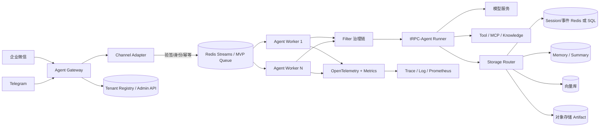
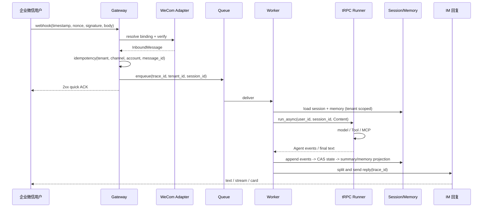

# 多租户节点化 Agent 平台架构设计

## 1. 目标与边界

平台在 tRPC-Agent-Python 之上提供统一的企业 IM Agent 入口。租户可以独立配置 Agent 应用、模型、工具、知识库、Session/Memory 后端、审计和预算；Gateway 与 Worker 可独立横向扩展；同一 Session 不依赖 sticky session。前 3 周代码以 InMemory 为可运行基线，并能接入 Redis、SQL、向量库和对象存储。

## 2. 设计原则

1. `tenant_id` 贯穿 binding、配置、队列、session key、存储、日志和 trace，入口不信任外部声明的租户。
2. 计算无状态、状态共享：Worker 每次从租户路由后的 Session/Memory 读取上下文。
3. 先验签、再去重、后入队；外部消息采用 at-least-once，业务处理采用幂等。
4. Session event 追加写，state/version 单调更新，summary 和向量是带版本的异步投影。
5. 工具默认拒绝，危险工具必须二次确认；输出、日志、trace 统一脱敏。
6. 配置 revision 不可变，灰度和回滚只切换租户指针，不修改历史版本。

## 3. 总体架构

组件职责如下：Gateway 负责 webhook、候选租户和 binding 解析、验签、限流、快速 ACK 和入队；Channel Adapter 将企业微信/Telegram 的 JSON/XML/Update 归一为 `InboundMessage`，并把 Agent 文本分段为平台消息；Worker 只编排一次 turn；Filter 执行用户权限、工具白名单、预算和脱敏决策；Storage Router 按租户配置选择后端；Admin API 管理租户配置 revision、发布和回滚；Telemetry 通过 `trace_id` 串起全链路。

## 4. 路由与无状态 Worker

单聊 Session ID 为 `HMAC-SHA256(service_key, tenant_id:channel:user_id)`，群聊为
`HMAC-SHA256(service_key, tenant_id:channel:chat_id)`；只保存截断后的不可逆 ID。实际存储 key 再加租户前缀。相同外部 user/chat ID 在两个租户中不会相交。

不需要 sticky session。生产队列使用 Redis Streams consumer group，Session 写入由 Redis lease 或 SQL version-CAS 串行化；Worker 崩溃后 pending 消息由其他 Worker reclaim。MVP 使用进程内队列和 `asyncio.Lock`，用于验证语义，不能作为多节点生产权威。

## 5. 完整消息链路

`trace_id` 在 callback 生成，随队列消息和 `InboundMessage` 传递；审计字段同时写入 tenant、channel、user、session、agent、tool、decision、latency、cost 和 error_type。

## 6. 复用边界

可直接复用 tRPC-Agent-Python：`LlmAgent`、`Runner.run_async`、Agent/Tool/MCP/Knowledge 编排、`InMemorySessionService`/`RedisSessionService`/`SqlSessionService`、Memory 服务、Filter 生命周期、FastAPI serving 和 OpenTelemetry exporter。平台新增：Tenant Registry/Config revision、Channel Adapter、session 路由与幂等、Storage Router、租户治理策略、审计/成本聚合、Admin API、队列恢复和部署配置。`trpc_service/agent/runner.py` 的 `TRPCAgentExecutor` 是上述 Runner 的最小适配点。

## 7. 预期效果

前 3 周验收：两租户端到端 Mock 链路可运行；企业微信和 Telegram 消息可验签、解析、分段；重复 message ID 不重复执行；相同 Session 并发写入保持 event sequence；拒绝越权工具和超长输入；健康检查、审计和 trace_id 可查询。第 4 周目标：Redis/SQL 高可用、真实模型与 IM、OTel/Prometheus、灰度回滚和故障演练达到生产试点标准。
