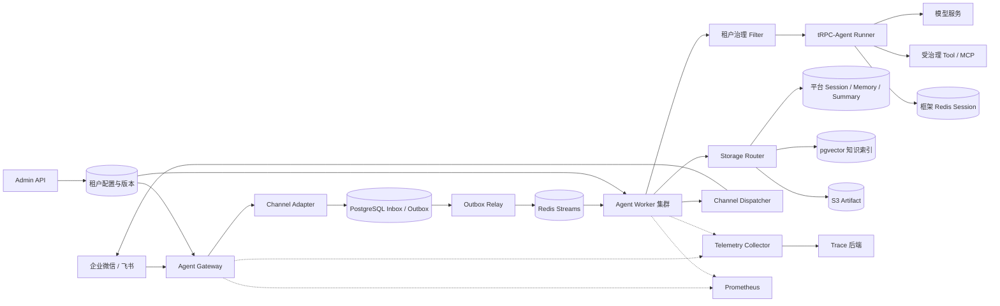
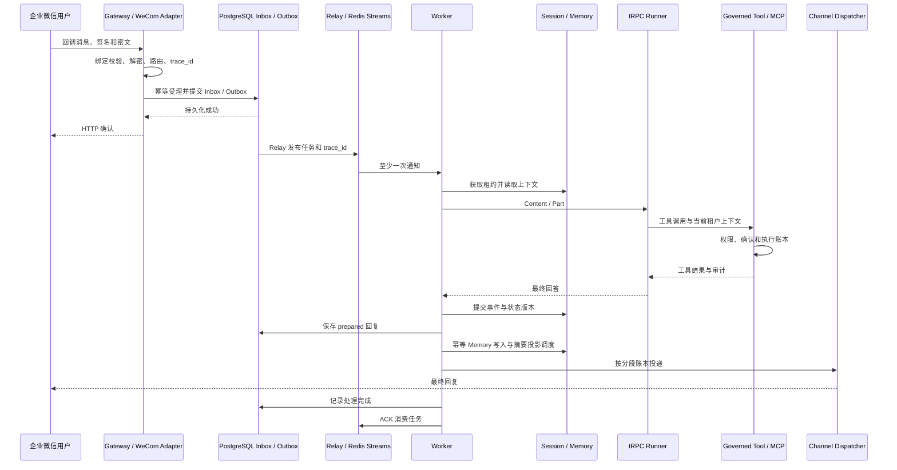

# 多租户节点化 Agent 平台架构设计

## 1. 建设目标与方案范围

平台基于 tRPC-Agent-Python，为多个企业租户提供统一的 Agent 接入与运行环境。租户可以独立配置应用、模型、工具权限、知识集合和数据后端，通过企业微信或飞书使用 Agent。平台负责将这些配置落实到消息路由、执行控制、数据访问和审计过程中，而不是仅在请求上附加租户标识。

方案采用控制面与运行面分离的架构。控制面管理租户配置及其版本，运行面负责接收消息、执行 Agent 和投递回复。计算节点通过共享状态协作，使 Gateway 和 Worker 能够分别扩容。本文按验收主题说明总体设计，各专题文档提供接口、配置和操作细节。

原题以架构设计为主。本文区分已有实现、运维方案和后续扩展，不将本地测试通过等同于生产环境验收通过。

## 2. 总体架构与组件职责

图中展示生产环境的持久化消息路径。Channel Adapter、Storage Router 和 Filter 是进程内模块，不需要分别部署为服务。Outbox Relay 随具备该职责的运行角色启动，将持久化任务发布到队列。

| 组件 | 主要职责 |
|---|---|
| Agent Gateway | 解析租户和通道绑定，完成回调处理、限流与消息受理。持久化成功后才确认 HTTP 消息 |
| Channel Adapter | 处理 IM 协议、验签、身份字段和媒体资源，将外部消息转换为统一输入 |
| Agent Worker | 消费任务，加载固定版本的配置，协调上下文读取、Agent 执行、状态提交和回复 |
| Storage Router | 按租户 StorageProfile 选择 Session、Memory、Audit、向量和对象存储 |
| Admin API | 提供配置管理、权限检查、版本发布、回滚、审计查询和失败任务恢复入口 |
| Telemetry Collector | 接收应用导出的 trace 并转发到观测后端。指标由 Prometheus 抓取 |

## 3. 多租户模型与隔离

`TenantConfig` 是租户配置的聚合根，包含应用集合、通道绑定、工具策略、审计策略和存储配置。每个 `AgentApp` 可以指定主备模型、密钥引用、超时、工具集合及知识集合。配置发布产生新 revision，历史版本用于消息重试和回滚。

隔离从入口开始。Gateway 根据服务端保存的 binding 校验账号与签名，不信任外部消息自行声明的访问范围。存储接口要求提供 tenant scope，SQL 使用租户条件和 RLS，工具执行同时检查租户及应用授权。密钥通过 SecretRef 解析，日志和自建 trace 使用脱敏处理。

当前 Session 按租户、通道和聊天范围隔离，Memory 则按租户与外部用户共享。因此，同一租户下的不同群聊或应用不能自动视为独立保密域。涉及敏感上下文时，应拆分租户，或扩展 Session/Memory 的作用域并迁移历史数据。

实体和实际存储关系见 [数据模型](data-model.md)，权限与密钥边界见 [治理和安全](security.md)。

## 4. 节点部署与水平扩展

生产部署区分 Gateway、Worker、Admin 和 Migration 四类角色。Gateway 处理入口流量，Worker 执行耗时任务，二者根据回调峰值和 Agent 并发分别扩容。Admin 使用控制面权限，Migration 使用独立 DDL 账号，避免运行节点持有数据库结构变更权限。

通用 HTTP 接入路径不依赖 sticky session。消息的 `session_id` 由服务端 HMAC 生成，多个 Worker 通过共享 Session、Memory 和队列协作。同一 Session 的写入使用租约、版本比较和 fencing epoch 保护，防止失效节点提交旧结果。

需要区分两层上下文：平台 Session 保存业务事件和状态，按租户选择 PostgreSQL 或 Redis。框架 Runner Session 保存框架执行上下文，当前生产路径使用共享 Redis，并以 `tenant_id:app_id` 区分应用。迁移或恢复时必须同时考虑这两层状态。

企业微信智能机器人长连接是例外。当前回复依赖接收进程保存的连接上下文，要求 `role=all`，不能直接套用 Gateway/Worker 分离模式。飞书长连接也有本地缓冲确认窗口，其可靠性边界见 [IM 接入](im-channels.md)。

本地演示使用单进程 InMemory。联调使用 [Docker Compose](../docker-compose.yml)，生产编排提供 [Kustomize 清单](../deploy/kustomize/base/kustomization.yaml)。部署职责及容量方法见 [运维方案](operations.md)。

## 5. 数据同步与幂等

生产环境以 PostgreSQL 保存配置、Inbox、Outbox 和审计。Redis Streams 承担任务通知，不是消息受理的唯一凭据。通知丢失时，系统可以根据持久化记录补发。Session 和 Memory 的权威后端由租户配置决定，不能一概视为 PostgreSQL 数据的缓存。

Worker 获得 Session 写租约后执行一轮对话，提交用户与助手事件并更新状态版本。已生成结果进入 `prepared` 状态，随后写入幂等 Memory、调度摘要投影并发送回复。投递失败时优先恢复已有结果，避免再次执行模型或重复提交 Session。

Inbox 唯一键处理外部重复消息，工具执行账本约束副作用重试，Outbound 账本记录分段投递结果。系统采用至少一次通知和业务幂等，不承诺外部 IM 或工具天然具备 exactly-once 语义。对于结果不确定的操作，恢复前需要人工确认。

摘要和知识向量依据 `source_version` 更新，允许短暂落后于事实数据。同一 Session 保证提交不互相覆盖，但不保证恢复 IM 原始发送顺序。同步流程、迁移和一致性取舍见 [数据一致性方案](consistency.md)。

## 6. 多后端存储

Storage Router 将业务访问与具体后端分离。Session、Memory 和 Audit 使用各自的接口契约，Knowledge 通过事实库与向量索引协作，Artifact 将文件内容与业务元数据分开保存。

| 后端 | 在方案中的用途 | 主要边界 |
|---|---|---|
| PostgreSQL | 配置、可靠消息记录、审计，以及可选的 Session/Memory | 事务覆盖单库操作，不能同时原子提交 Redis 或 S3 |
| Redis | 消息队列、限流、框架 Session，以及可选的平台状态 | 原子命令不等于零数据丢失，持久化和故障切换仍需配置与演练 |
| pgvector | Knowledge 和摘要的向量检索 | 索引由事实数据派生，可能存在投影延迟 |
| S3 兼容对象存储 | 图片、文件等 Artifact 内容 | checksum 校验完整性，SQL 元数据与对象上传需要失败补偿 |
| InMemory | 单进程开发和测试 | 不提供持久化或跨节点共享 |

新增后端需要实现相应访问契约并注册，不是仅增加配置名称即可生效。接口及迁移步骤见 [多后端与迁移](consistency.md)。

## 7. IM 接入与消息转换

企业微信与飞书均由专用 Adapter 接入，Worker 不直接解析 XML、平台事件结构或回调签名。消息统一转换为 `InboundMessage`，再由 `TRPCAgentExecutor` 构造框架 `Content/Part`。经过租户校验的媒体资源可以作为多模态输入。

企业微信应用回调使用 Token 和 EncodingAESKey，智能机器人长连接使用 Bot ID 和 Secret。飞书提供 Webhook 与 SDK 长连接，两种模式通过 Open API 回复。它们在身份字段、回调确认、媒体资源和连接依赖上存在差异，不能共用一套平台协议处理。

当前通用 Runner 仅提取最终回答，再由 Channel Dispatcher 分段投递。飞书 Adapter 提供卡片与撤回接口，但这不意味着 Agent 任意事件都能自动转换为卡片。企业微信 Bot 使用流式回复接口发送完成态内容，也不等同于逐 token 输出。

接入步骤、两种 IM 的对比和限制见 [IM 通道方案](im-channels.md)，飞书配置示例见 [飞书操作指南](feishu-setup.md)。

## 8. 治理、监控与审计

平台在执行前检查用户权限、输入限制、工具白名单和预算。危险工具需要绑定租户、用户、Session、工具名称及参数的一次性确认。非幂等工具在结果不确定时停止自动重试，避免重复产生外部副作用。

Prometheus 指标覆盖请求、模型与工具耗时、存储访问、队列、投递结果、token 和租户成本。高基数字段保留在 trace 或审计中，不直接作为指标标签。当前 token 和费用根据文本长度及配置价格估算，不能作为模型供应商账单。

审计模型包含 tenant、channel、user、session、agent、tool、decision、latency、error_type、cost 和 trace_id。部分工具记录的耗时或费用字段仍使用默认值。自建 span 不自动记录原始异常文本，第三方 SDK 和自动 instrumentation 仍需额外检查敏感信息采集。

详细策略见 [治理、监控与安全](security.md)，端到端 trace 传递见下一节。

## 9. 完整消息时序与 Trace 关联

以下以企业微信应用 HTTP 回调和生产持久化队列为例。长连接模式不完全适用该确认顺序。

HTTP 入口优先采用 FastAPI 当前 OTel span 的 trace ID。没有有效 span 时，服务使用合法的 `x-trace-id` 或生成新 ID。该标识随 Inbox/Outbox、队列消息、SessionEvent、审计和回复信封传递。Worker 使用它关联消费、Runner、Tool、Session/Memory 读写和 IM 回复。

当前跨进程传递的是 trace ID，而不是完整的 W3C `traceparent/tracestate`。因此可以按同一 trace 检索相关 span，但不保证跨进程父子树完整。外部 IM 回执通过投递账本中的平台 message ID 关联，不要求 IM 接受自定义 tracing header。回归验证见 [test_telemetry.py](../tests/test_telemetry.py)。

## 10. 故障恢复、发布与容量

Worker 故障后，其他消费者可以接管 pending 任务，并在写租约过期后继续处理。fencing 检查用于拒绝旧节点提交。Redis 通知丢失由 Outbox 补偿，SQL 受理失败则不能提前确认 HTTP 消息。模型超时和工具失败分别通过超时控制、主备模型及执行账本处理，最终失败进入恢复流程。

配置发布和回滚已有 revision/CAS API。当前灰度方案采用运维选择测试租户、观察指标、逐批扩大范围的方式，尚未接入自动百分比调度和阈值回滚控制器。消息入队时固定配置版本，不保证整个 Session 永久固定版本。

容量规划根据消息峰值、平均执行时长、模型额度、工具并发和后端 QPS 计算，随后在目标环境压测确认。生产上线还需要真实 RLS、多节点恢复、密钥轮换和备份恢复证据。

操作步骤见 [生产运行手册](production-runbook.md)，计算方法见 [容量评估](operations.md)，风险及缓解措施见 [16 项风险清单](risks.md)。

## 11. 框架复用与后续扩展

### 11.1 当前复用与自建范围

| 分类 | 实际接入方式 |
|---|---|
| 直接复用 | `LlmAgent`、`Runner.run_async`、`OpenAIModel`、Content/Part、InMemory/RedisSessionService，入口为 `agent/factory.py` 和 `agent/runner.py` |
| 复用并增加平台治理 | FunctionTool、MCPToolset/MCPTool，由 `tool/integration.py` 包装权限、确认、执行账本和审计 |
| 平台自建 | 租户与配置版本、IM Adapter、Gateway/Admin、队列与可靠消息、Storage Router、租约和 fencing |
| 同类能力由平台实现 | TenantPolicyFilter、Memory/Summary/Knowledge 存储及投影、审计、FastAPI 路由和 OTel/Prometheus 接入 |

### 11.2 “可选但未集成”的准确含义

这一表述指候选技术方案或扩展方向尚未接入当前运行路径，不是所有基础能力都缺失，也不是打开配置就能启用。此前将不同性质的项目放在同一行容易产生误解，现按影响区分：

| 候选方向 | 当前方案与未接入部分 |
|---|---|
| 框架 SQL SessionService | 平台已有 PostgreSQL Session。未接入的是用框架 SQL 服务替换 Runner 当前 Redis Session，二者属于不同状态层 |
| 框架 Memory/Knowledge/Filter 生命周期 | 平台已自行实现记忆、知识检索和治理。未接入的是将这些职责改由框架对应服务或生命周期承接 |
| 多 Agent 编排 | 当前为租户应用创建 LlmAgent/Runner。复杂协作工作流需要额外定义编排、配置和测试，不是现有多租户能力的前置条件 |
| Skills 自动装载 | `skill` 目录是预留入口，没有按租户发现、授权和装载 Skill 的完整流程 |
| A2A / AG-UI 接口 | 本项目未实现这些对外协议入口。它们不参与当前 IM 消息链路，是否接入取决于后续互操作需求 |
| 沙箱执行 | `workspace` 文档仅约定工作目录和隔离要求，没有容器任务调度、资源限制或完整执行服务 |

这些候选项不作为已交付功能，也不应与自动迁移、自动灰度等已有方案的工程化缺口混为一谈。原题逐项验收及仍需环境验证的内容见 [检查清单](requirements-audit.md)。
